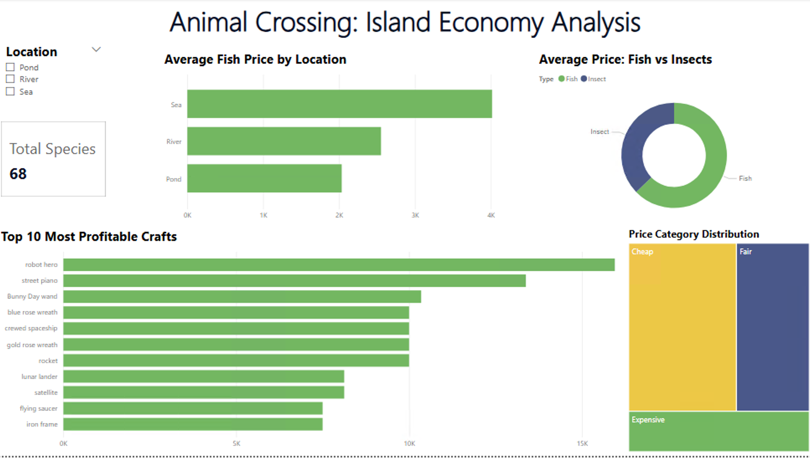

# Animal Crossing: New Horizons — Island Economy Analysis

## 📊 Project Overview
This project explores the in-game economy of Animal Crossing: New Horizons. The goal was to identify the most efficient ways to earn "Bells" (in-game currency) by analyzing fauna (fish/insects) and the crafting system.

## 🛠 Tools Used
- **SQL (SQLite):** Data cleaning, merging 10+ tables, and complex supply chain margin calculations using CTEs.
- **Power BI:** Data transformation (Power Query) and interactive dashboarding.

## 💡 Key Insights
- **The Crafting Paradox:** High-value items are not always the most profitable. For example, while the "Robot Hero" sells for 250,000 Bells, the total market value of its ingredients is ~234,000, resulting in a thin profit margin of only ~6%.
- **Fishing vs. Bug Catching:** Fishing is significantly more lucrative, yielding on average 40% more Bells per catch compared to bug catching.
- **Top Locations:** The Sea is the most profitable fishing zone, with average prices significantly higher than rivers or ponds.

## 🧠 SQL Skills Demonstrated
- **Data Consolidation:** Merging 10+ disparate category tables into a unified master price list using `UNION`.
- **Complex Supply Chain Logic:** Calculating true profit margins by performing multiple `LEFT JOIN` operations (7-way join) to account for the final product price and the individual costs of all 6 potential recipe ingredients.
- **Advanced Data Transformation:** Using `COALESCE` for null-handling in arithmetic operations and `HAVING` for statistical filtering.

## ⚠️ Data Limitations (The "Real Talk" Section)
- **Spawn Rates:** While included in the raw data, Spawn Rates were excluded from the final value model due to scaling inconsistencies between fish and insects.
- **Labor Costs:** The model does not account for the time ("opportunity cost") required to farm rare resources like Star Fragments or Iron Nuggets.
- **Time-of-Day Constraints:** Analysis focuses on monthly availability, ignoring specific hourly windows for rare species.

## 🖼 Dashboard Preview

